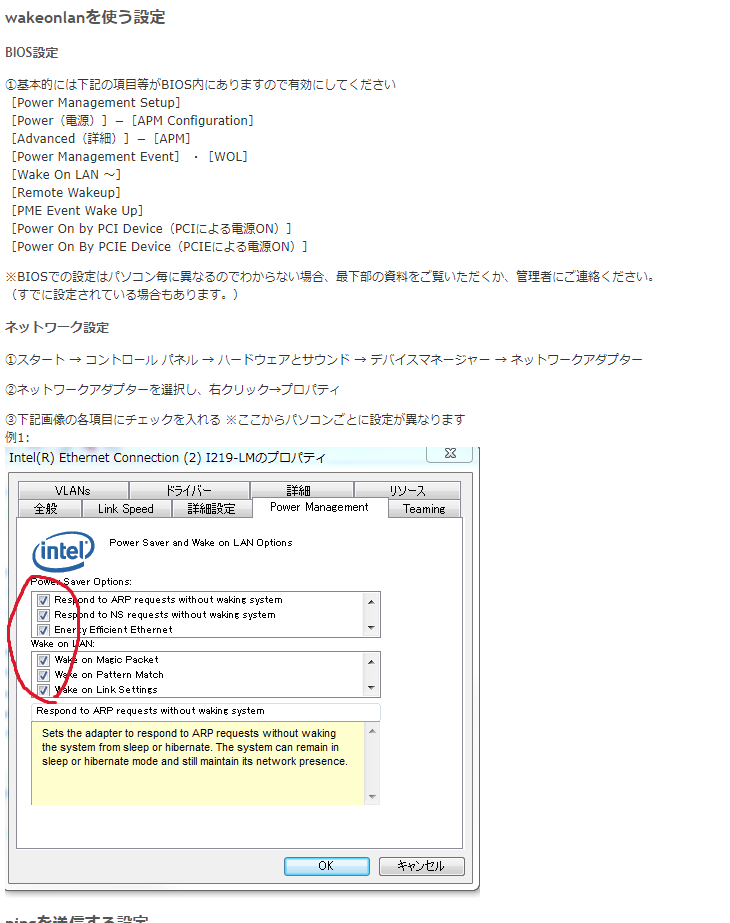
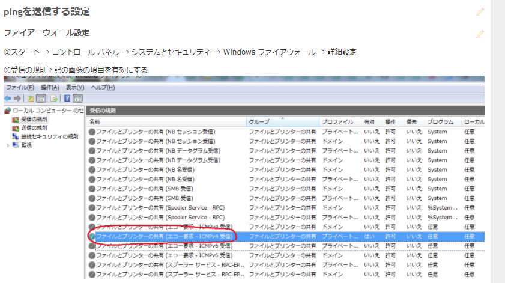

# wakeonlan

Sample Wake on lan on Web interface

## Need remote machien setting

# Usage

## environment 
Apache  
PHP

## on boot
~~~
#run user apache
shell_exec("wakeonlan.sh ".$mac_address);
~~~

## is boot?
~~~
$res = shell_exec("ping -c 4 -W 5 ".$ip_address);
$array = explode("\n",$res);
if(strripos($res,'0 received') === false){
    $ping = "boot success";
}else{
    $ping = "boot failed";
}
~~~

## if send ping to failed

## etc 
### batch
~~~
#Run cron
#Need to change *.*.*. (192.168 or 172.16 or ....)
arp_update.sh 
~~~

### (ip address → mac address) and (mac address → ip address)
~~~
//ip address → mac address
if(isset($ip_address && $ip_address != ""){
    $mac = "";
    $pcs = shell_exec("nmap -sP {$ip_address} ");
    $pcs = shell_exec("arp -a");
    $pcss = explode("\n",$pcs);

    foreach($pcss as $value){
        if(strripos($value,$ip_address !== false){
            if(preg_match("/([0-9A-Fa-f]{2}[:-]){5}[0-9A-Fa-f]{2}/",$value,$match) === 1){
                $mac = $match[0];
                break;
            }
        }
    }
    if($mac != ""){
        $ping = "　{$ip_address} → MAC address　{$mac}";
    }else{
        $ping = "get faild";
    }
}
~~~

~~~
//mac address → ip address 
if(isset($mac_address) && $mac_address != ""){
    $ip = "";
    #Need to change *.*.*. (192.168 or 172.16 or ....)
    $pcs = shell_exec("nmap -sP 192.168.6.* ");
    $pcs = shell_exec("arp -a");
    $pcss = explode("\n",$pcs);

    foreach($pcss as $value){
        if(strripos($value,$mac_address) !== false){
            if(preg_match("/\(([a-zA-Z0-9.]+)\)/",$value,$match) === 1){
                $ip = substr(substr($match[0],1),0,-1);
                break;
            }
        }
    }
    if($ip != ""){
        $ping = "MAC address　{$mac_address} → IP address　{$ip}";
    }else{
        $ping = "get failed";
    }
}

~~~
